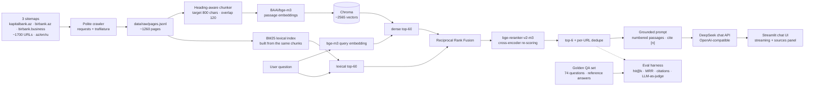

# Kapital Bank RAG Assistant 🏦🤖

A multilingual **Retrieval-Augmented Generation** chatbot over public content scraped from
[kapitalbank.az](https://kapitalbank.az) — cards, loans, deposits, transfers, insurance, FAQ.
Answers are grounded in retrieved passages with inline citations; when the knowledge base
doesn't contain the answer, the assistant says so instead of hallucinating.

> Educational/portfolio project — not affiliated with Kapital Bank OJSC.

## Architecture



Pipeline stages (each isolated in `kb_rag/`):

| Stage | Module | What it does |
|---|---|---|
| Scrape | `scraper/` | Sitemap-driven crawl, robots-friendly, redirect tracking (`final_url`), main-content extraction via trafilatura |
| Chunk | `ingest/chunking.py` | Split markdown on headings → breadcrumb metadata (`Cards > Birbank Miles`), then sliding window within each section |
| Embed | `ingest/embeddings.py` | Local `BAAI/bge-m3` (8 k multilingual encoder, no task prefixes needed), L2-normalized; runs on CUDA when a GPU is present |
| Index | `ingest/store.py` | Chroma persistent collection, cosine space, metadata: url/lang/section/section_path |
| Retrieve | `rag/hybrid.py`, `rag/retriever.py` | Hybrid search: dense ANN ∪ BM25 lexical, fused by reciprocal rank fusion, re-scored by a multilingual cross-encoder (`BAAI/bge-reranker-v2-m3`), then per-URL dedupe so one long page can't crowd out the context window |
| Generate | `rag/` | Strict grounding prompt (answer only from context, cite `[n]`, refuse if absent), streaming via OpenAI-compatible client to DeepSeek |
| Evaluate | `evaluation/` | Retrieval hit@k & MRR against expected sources; faithfulness/correctness 1–5 by an LLM judge; refusal accuracy on unanswerable questions |

## Design decisions worth asking about in an interview

- **Why local embeddings instead of an embeddings API?** Zero cost and zero data egress for the
  ingestion path — the right default for banking documents. `BAAI/bge-m3` covers Azerbaijani,
  Russian and English in one vector space, so cross-language retrieval works out of the box.
- **Why heading-aware chunking?** Bank pages are structured (rates, fees, eligibility). Splitting on
  headings first keeps each chunk about one topic and gives every chunk a breadcrumb
  (`section_path`) that doubles as a citation label and a filterable field.
- **How is hallucination constrained?** Three layers: (1) the system prompt restricts answers to the
  numbered context and demands `[n]` citations; (2) temperature 0.2; (3) unanswerable questions in
  the golden set verify the refusal path — the model must admit missing information rather than invent it.
- **Why hybrid retrieval instead of vectors alone?** Dense embeddings capture paraphrase
  ("how do I freeze my card?" ≈ "blocking a lost card") but under-match exact tokens —
  product names ("BirKart"), rates ("10.9%"), transliterated terms — which bank queries hinge
  on. BM25 supplies lexical precision; reciprocal rank fusion merges the rankings without
  needing to calibrate cosine similarity against BM25 scores; a multilingual cross-encoder
  (`bge-reranker-v2-m3`) then re-scores the fused pool jointly (query + passage in one
  forward pass), which is far more accurate than the independent-embedding approximation.
  Each stage is a config toggle — the system degrades gracefully to pure dense search.
- **How do we know it works?** The eval harness scores retrieval objectively (did an expected source
  page make top-k, at what rank), citations programmatically (`[n]` markers must exist and their
  sentences must overlap the cited passage), and generation against **reference answers** verified
  against the corpus — the LLM judge scores faithfulness (nothing invented beyond context) and
  correctness (matches ground truth, not just "consistent with whatever was retrieved"). Every run
  writes a manifest (config snapshot + git SHA + dataset hash) and the canonical CSVs are
  committed; seeded re-runs quantify variance; a cross-family judge ablation bounds self-bias.

## Measured evaluation results

`python -m kb_rag.evaluation.runner` on the 74-question golden set (62 answerable
across az/en/ru with corpus-grounded **reference answers**, 12 unanswerables:
private data, future rates, off-domain requests), deepseek-chat generating and
judging (`run_20260827_150822`, manifest committed):

| Metric | Value | What it tells you |
|---|---|---|
| Retrieval hit@6 | **91.9%** | share of answerable questions where an expected source page made top-6 |
| MRR@6 | **0.808** | how high the first relevant page ranks |
| Judge faithfulness (1–5) | **4.85** | answers rarely claim anything beyond the context |
| Judge correctness (1–5) | **4.55** | now scored *against reference ground truth*, not just context consistency |
| Refusal accuracy | **91.7%** | unanswerable *and off-domain* questions get an explicit refusal (11/12) |
| Citations | 100% valid · 83% supported · 60% coverage | every `[n]` marker points at a real passage; most citing sentences lexically overlap it |

**On the numbers across phases:** the earlier 72% was measured on a stricter,
mislabeled 30-question set that counted corpus gaps as retrieval misses. After
Phase 3 rebuilt the eval (reference answers, label fixes, questions drafted
against pages that exist), the same system scores 91.9% overall and **87% on
the 23 surviving original questions**. Retrieval improvement 52% → 72% on the
legacy set remains the honest before/after for the *retriever* work (section
taxonomy, FAQ extraction, rerank-pool tuning, BM25 IDF scoping); query-side
experiments (embedding ablation, expansion, morphology) are recorded as
measured wins and losses. Full run history, seed variance (±0.03), independent
judge agreement, and per-category breakdowns live in
[docs/improvement_plan.md](docs/improvement_plan.md) and
[docs/hybrid_retrieval.md](docs/hybrid_retrieval.md).

The before/now progression that produced these numbers (single-sitemap
dense-only vs. three-sitemap hybrid retrieval), plus a four-way
configuration ablation, is documented in [docs/hybrid_retrieval.md](docs/hybrid_retrieval.md).

The judge scores each answer against the exact numbered passages the generator saw,
so faithfulness here means "nothing claimed beyond the retrieved text" — verified, not
assumed. Off-domain questions (math, coding, general knowledge) are refused outright by
a dedicated domain-gate rule rather than answered from the LLM's general knowledge.

The classic RAG pattern held all the way up: hybrid BM25 + the `bge-reranker-v2-m3`
cross-encoder lifted the legacy-set hit-rate from 52% to 72%, and the remaining misses
turned out to be *evaluation* defects, not more tuning targets — corpus gaps and
mislabeled expectations, fixed in Phase 3 (label corrections, honest reclassification,
reference answers). Five genuine retrieval misses remain on the rebuilt set — e.g. the
English premium-card query and a deposit page stuck at rank 7 — and the multi-turn item
proves the retriever never sees chat history (a bare follow-up retrieves nothing), which
is the next known gap to close. The embedding choice was validated head-to-head (`BAAI/bge-m3` 72% vs
`multilingual-e5-base` 64% — the entire gap is FAQ recall, where e5's 512-token
window truncates Q&A listings), and two query-understanding experiments —
cross-language LLM query expansion and morphology-aware BM25 tokens — each
measured *below* the 72% baseline and ship as config toggles that are off by
default, written up as negative results.

Data-engineering findings baked into this repo:

- kapitalbank.az now 301s nearly every legacy product slug onto consolidated birbank.az
  pages. The corpus therefore spans three sitemaps (kapitalbank.az, birbank.az,
  birbank.business); the scraper records both URL identities (`source_url` / `final_url`),
  indexing dedupes on the destination *and* on whitespace-normalized text — birbank serves
  identical Azerbaijani content under `/en/…` and `/ru/…` paths, which would otherwise
  triplicate passages in every result list.
- Golden-set expectations match either URL identity, so redirect consolidation doesn't
  hide hits from retrieval metrics.
- Most birbank.az responses ship no `charset` header, so naive `resp.text` decoding
  corrupted ~40% of the corpus with mojibake (`Nağd` → `NaÄd`). Fixed at the source
  (decode bytes as UTF-8, sniff only on failure), repaired historically with an
  [ftfy](https://pypi.org/project/ftfy/)-based pass (`python -m scripts.repair_pages`);
  unrecoverable pages are excluded by config rather than indexed dirty.
- Interactive order-form widgets (`ccl.birbank.az`) carry no knowledge content and are
  dropped by a configurable URL-pattern filter honored by both crawler and indexer.

## Quickstart

```bash
python -m venv .venv && .venv\Scripts\activate     # Windows
pip install -r requirements.txt

copy .env.example .env                     # then paste your DEEPSEEK_API_KEY into .env

# 1) scrape all three sitemaps (~1260 pages across az/en/ru, ~15 min)
python -m scripts.scrape                           # add --langs az en or --limit N to trim

# 2) build the vector index (first run downloads bge-m3, ~2.2 GB; ~1.5 min on GPU, longer on CPU)
python -m scripts.build_index --reset

# 3) chat
streamlit run app.py

# 4) evaluate
python -m kb_rag.evaluation.runner                 # writes eval_results/run_*.csv
```

Example questions:

- `Kapital Bankın taksit kartları hansılardır?`
- `Which premium cards does the bank offer?`
- `Как отправить перевод через Золотая Корона?`

## Project layout

```
kb_rag/
├── scraper/        # sitemap parsing + polite crawler + content extraction
├── ingest/         # chunking → embeddings → Chroma store
├── rag/            # retriever, prompts, DeepSeek client, pipeline
└── evaluation/     # golden set loader, retrieval metrics, LLM-as-judge, runner
scripts/            # scrape.py · build_index.py · make_golden_set.py
tests/              # unit tests (chunker, metrics, prompts) — no network needed
app.py              # Streamlit chat UI
config.yaml         # models, chunk sizes, top_k — all tunable without code changes
```

## Future work

- Migrate the store to pgvector for SQL-side hybrid filtering
- Extend evaluation with answer-vs-source attribution checking (citation precision/recall)
- Credit-risk flavored modules: tariff comparison tools, synthetic-data risk-driver analysis

## Further reading

- [Hybrid retrieval](docs/hybrid_retrieval.md) — dense + BM25 + RRF + cross-encoder design, test coverage, and measured ablation results.
