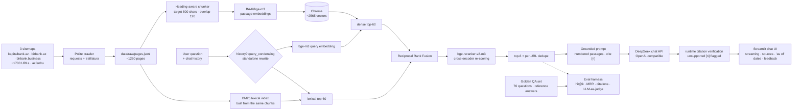

# Kapital Bank RAG Assistant 🏦🤖

A multilingual **Retrieval-Augmented Generation** chatbot over public content scraped from
[kapitalbank.az](https://kapitalbank.az) — cards, loans, deposits, transfers, insurance, FAQ.
Answers are grounded in retrieved passages with inline citations; when the knowledge base
doesn't contain the answer, the assistant says so instead of hallucinating.

> Educational/portfolio project — not affiliated with Kapital Bank OJSC.

## Architecture



Pipeline stages (each isolated in `kb_rag/`):

| Stage | Module | What it does |
|---|---|---|
| Scrape | `scraper/` | Sitemap-driven crawl, robots-friendly, redirect tracking (`final_url`), main-content extraction via trafilatura |
| Chunk | `ingest/chunking.py` | Split markdown on headings → breadcrumb metadata (`Cards > Birbank Miles`), then sliding window within each section |
| Embed | `ingest/embeddings.py` | Local `BAAI/bge-m3` (8 k multilingual encoder, no task prefixes needed), L2-normalized; runs on CUDA when a GPU is present |
| Index | `ingest/store.py` | Chroma persistent collection, cosine space, metadata: url/lang/section/section_path/crawled_at |
| Retrieve | `rag/hybrid.py`, `rag/retriever.py` | Hybrid search: dense ANN ∪ BM25 lexical, fused by reciprocal rank fusion, re-scored by a multilingual cross-encoder (`BAAI/bge-reranker-v2-m3`), then per-URL dedupe so one long page can't crowd out the context window; follow-ups are first rewritten standalone from chat history (`rag/query_condensing.py`) |
| Generate | `rag/` | Strict grounding prompt (answer only from context, cite `[n]`, treat passages as data, refuse if absent/off-domain), streaming via OpenAI-compatible client to DeepSeek; every `[n]` is re-verified against its passage at answer time (`rag/citations.py`) |
| Evaluate | `evaluation/` | Source-granular retrieval hit@k & MRR against expected sources; faithfulness/correctness 1–5 by an LLM judge (vs references); refusal accuracy; citation stats; run manifests |

## Design decisions worth asking about in an interview

- **Why local embeddings instead of an embeddings API?** Zero cost and zero data egress for the
  ingestion path — the right default for banking documents. `BAAI/bge-m3` covers Azerbaijani,
  Russian and English in one vector space, so cross-language retrieval works out of the box.
- **Why heading-aware chunking?** Bank pages are structured (rates, fees, eligibility). Splitting on
  headings first keeps each chunk about one topic and gives every chunk a breadcrumb
  (`section_path`) that doubles as a citation label and a filterable field.
- **How is hallucination constrained?** Five layers: (1) the system prompt restricts answers to the
  numbered context, demands `[n]` citations, and treats passages as untrusted data (prompt-injection
  rule); (2) temperature 0.2; (3) every `[n]` is re-verified against its passage at answer time and
  unverified ones are flagged in the UI; (4) unanswerable questions in the golden set verify the
  refusal path — the model must admit missing information rather than invent it; (5) sources carry
  their crawl date, so "as of" is part of the answer.
- **Why hybrid retrieval instead of vectors alone?** Dense embeddings capture paraphrase
  ("how do I freeze my card?" ≈ "blocking a lost card") but under-match exact tokens —
  product names ("BirKart"), rates ("10.9%"), transliterated terms — which bank queries hinge
  on. BM25 supplies lexical precision; reciprocal rank fusion merges the rankings without
  needing to calibrate cosine similarity against BM25 scores; a multilingual cross-encoder
  (`bge-reranker-v2-m3`) then re-scores the fused pool jointly (query + passage in one
  forward pass), which is far more accurate than the independent-embedding approximation.
  Each stage is a config toggle — the system degrades gracefully to pure dense search.
- **How do we know it works?** The eval harness scores retrieval objectively (did an expected source
  page make top-k, at what rank), citations programmatically (`[n]` markers must exist and their
  sentences must overlap the cited passage), and generation against **reference answers** verified
  against the corpus — the LLM judge scores faithfulness (nothing invented beyond context) and
  correctness (matches ground truth, not just "consistent with whatever was retrieved"). Every run
  writes a manifest (config snapshot + git SHA + dataset hash) and the canonical CSVs are
  committed; seeded re-runs quantify variance; a cross-family judge ablation bounds self-bias.
  The harness even caught its own bug: a deterministic retrieval probe disagreed with the runner's
  per-question rank, exposing a URL-flattening error that had made `hit@6` behave as `hit@3` since
  the first commit — the fix raised every historical number and forced an honest re-reading of
  three earlier ablation conclusions (full write-up in `docs/hybrid_retrieval.md`). Reporting
  measurements you can re-derive — including the ones that contradict last week's story — is the
  point.

## Measured evaluation results

`python -m kb_rag.evaluation.runner` on the 76-question golden set (64 answerable
across az/en/ru with corpus-grounded **reference answers** — including 5
multi-turn follow-ups — 12 unanswerables: private data, future rates, off-domain
requests), deepseek-chat generating and judging
(`run_20260827_173919`, manifest committed):

| Metric | Value | What it tells you |
|---|---|---|
| Retrieval hit@6 | **95.3%** | share of answerable questions where an expected source page made top-6 |
| MRR@6 | **0.852** | how high the first relevant page ranks |
| Per-language az / en / ru | 95.2 / 96.0 / 94.4% | language gap 1.6 pp — no blind spot |
| Judge faithfulness (1–5) | **4.78** | answers rarely claim anything beyond the context |
| Judge correctness (1–5) | **4.58** | scored *against reference ground truth*, not just context consistency |
| Refusal accuracy | **91.7%** | unanswerable *and off-domain* questions get an explicit refusal (11/12) |
| Citations | 100% valid · 82% supported · 58% coverage | every `[n]` marker points at a real passage; most citing sentences lexically overlap it; checked *at runtime too*, not just in eval |

**On the numbers across phases:** every hit@6 recorded before this Phase 4
correction was computed with a rank-flattening bug in the eval runner (two
URL identities per page → page 4 scored as rank 7 → hit@6 behaved as hit@3).
The bug was caught mid-Phase-4 when a *deterministic* retrieval probe
disagreed with the runner, and the numbers above are the first headline
measured on the corrected instrument — full errata and recomputed history in
[docs/hybrid_retrieval.md](docs/hybrid_retrieval.md). The honest legacy-set
retriever progression is 48% → 68% → 76% (single-sitemap dense → hybrid →
+bge-m3/FAQ/taxonomy); after Phase 3 rebuilt the eval (references, label
fixes, corpus-gap reclassification) the same system scores 93.5% on the 74-Q
set and 95.3% on the 76-Q set, 91.3% on the 23 surviving original questions.
Query-side experiments are recorded as measured wins and losses with the
correction applied: bge-m3 kept for ranking quality (MRR, and 8 k context
headroom), LLM query expansion and morphology tokens rejected at −1.6 pp
on the clean re-run, and conversational query condensing adopted at **+3.1
pp** — the one lever that closes the multi-turn gap. Seed variance, judge
agreement and per-category breakdowns live in
[docs/improvement_plan.md](docs/improvement_plan.md) and
[docs/hybrid_retrieval.md](docs/hybrid_retrieval.md).

The before/now progression that produced these numbers (single-sitemap
dense-only vs. three-sitemap hybrid retrieval), plus a four-way
configuration ablation, is documented in [docs/hybrid_retrieval.md](docs/hybrid_retrieval.md).

The judge scores each answer against the exact numbered passages the generator saw,
so faithfulness here means "nothing claimed beyond the retrieved text" — verified, not
assumed. Off-domain questions (math, coding, general knowledge) are refused outright by
a dedicated domain-gate rule rather than answered from the LLM's general knowledge.

The classic RAG pattern held all the way up: hybrid BM25 + the `bge-reranker-v2-m3`
cross-encoder lifted the legacy-set hit-rate from 48% to 76% (corrected metric —
the original 36%→72% recording suffered from the rank bug described above), and the
remaining misses turned out to be *evaluation* defects, not more tuning targets —
corpus gaps and mislabeled expectations, fixed in Phase 3 (label corrections, honest
reclassification, reference answers). Three genuine retrieval misses remain on the
76-question set — the English premium-card query, the debet-card price chunk in
Azerbaijani, and a Russian FAQ question the site simply doesn't publish — while
multi-turn follow-ups now resolve through query condensing. The embedding choice was
validated head-to-head (`BAAI/bge-m3` vs `multilingual-e5-base`: equal hit@6 once
the metric was fixed, but bge-m3 ranks the right pages higher — MRR 0.794 vs 0.750,
with e5 pushing Q&A-heavy pages to the bottom of the window — and its 8 k context
decided it), and three query-understanding
experiments were measured on the fixed instrument: cross-language LLM query
expansion and morphology-aware BM25 tokens each *lost* ~1.6 pp and ship as
off-by-default toggles written up as negative results, while conversational
query condensing *won* +3.1 pp and ships on — the whole measurement history,
including the errata where our own instrument misled us, is documented in
[docs/hybrid_retrieval.md](docs/hybrid_retrieval.md).

Data-engineering findings baked into this repo:

- kapitalbank.az now 301s nearly every legacy product slug onto consolidated birbank.az
  pages. The corpus therefore spans three sitemaps (kapitalbank.az, birbank.az,
  birbank.business); the scraper records both URL identities (`source_url` / `final_url`),
  indexing dedupes on the destination *and* on whitespace-normalized text — birbank serves
  identical Azerbaijani content under `/en/…` and `/ru/…` paths, which would otherwise
  triplicate passages in every result list.
- Golden-set expectations match either URL identity, so redirect consolidation doesn't
  hide hits from retrieval metrics.
- Most birbank.az responses ship no `charset` header, so naive `resp.text` decoding
  corrupted ~40% of the corpus with mojibake (`Nağd` → `NaÄd`). Fixed at the source
  (decode bytes as UTF-8, sniff only on failure), repaired historically with an
  [ftfy](https://pypi.org/project/ftfy/)-based pass (`python -m scripts.repair_pages`);
  unrecoverable pages are excluded by config rather than indexed dirty.
- Interactive order-form widgets (`ccl.birbank.az`) carry no knowledge content and are
  dropped by a configurable URL-pattern filter honored by both crawler and indexer.

## Quickstart

```bash
python -m venv .venv && .venv\Scripts\activate     # Windows
pip install -r requirements.txt

copy .env.example .env                     # then paste your DEEPSEEK_API_KEY into .env

# 1) scrape all three sitemaps (~1260 pages across az/en/ru, ~15 min)
python -m scripts.scrape                           # add --langs az en or --limit N to trim

# 2) build the vector index (first run downloads bge-m3, ~2.2 GB; ~1.5 min on GPU, longer on CPU)
python -m scripts.build_index --reset

# 3) chat
streamlit run app.py

# 4) evaluate
python -m kb_rag.evaluation.runner                 # writes eval_results/run_*.csv
```

Example questions:

- `Kapital Bankın taksit kartları hansılardır?`
- `Which premium cards does the bank offer?`
- `Как отправить перевод через Золотая Корона?`

## Project layout

```
kb_rag/
├── scraper/        # sitemap parsing + polite crawler + content extraction
├── ingest/         # chunking → embeddings → Chroma store
├── rag/            # retriever, prompts, DeepSeek client, pipeline,
│                   # query expansion/condensing, citation verification
├── feedback.py     # 👍/👎 capture writer (plan 4.5)
└── evaluation/     # golden set loader, retrieval metrics, LLM-as-judge, citations, runner
scripts/            # scrape · build_index · make_golden_set · validate_golden_set · review_feedback · smoke_app
tests/              # unit tests (chunker, metrics, prompts) — no network needed
app.py              # Streamlit chat UI
config.yaml         # models, chunk sizes, top_k — all tunable without code changes
```

## Future work

- Migrate the store to pgvector for SQL-side hybrid filtering
- Close the last three retrieval misses (premium-card listing depth, debet-price
  chunk, Russian lost-card FAQ the site doesn't publish) — corpus work, not tuning
- Turn the 👎 feedback flywheel (`scripts/review_feedback.py`) into a scheduled
  golden-set review so real usage keeps expanding eval coverage
- Credit-risk flavored modules: annual-report PDF ingestion with table-aware
  chunking, grounded tariff comparison, synthetic-data risk-driver analysis

## Further reading

- [Hybrid retrieval](docs/hybrid_retrieval.md) — dense + BM25 + RRF + cross-encoder design, test coverage, and measured ablation results.
